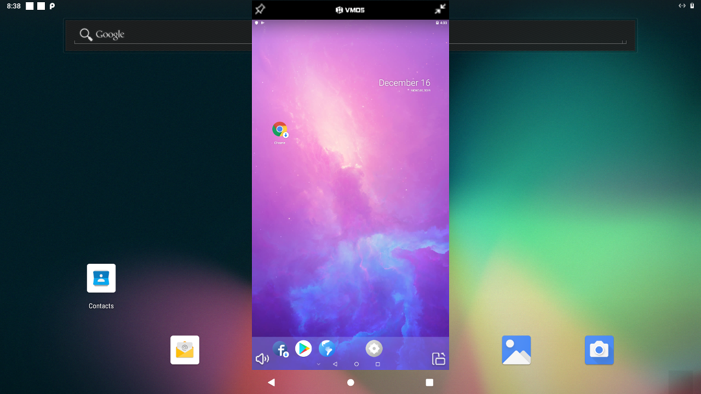

# Technexion Android 9 SDK for i.MX8 Platforms
## Download The Source Code

Github way (Prepare repo command first is recommended)

Install repo first:

    $ sudo apt-get install repo

Latest release: TN2.0 (20191216)

    Changelog:
    1. GPU performance improvement
    2. Add LIBGPIOD JNI app
    3. Add openssh/ethtool libraries

    $ repo init -u https://github.com/technexion-android/manifest -b tn-p9.0.0_2.0.1_8m-ga_tn2.0
    $ repo sync -j<N> (N is up to cors numbers on your host PC)

Earlier release: TN1.0 (20191020)

    $ repo init -u https://github.com/technexion-android/manifest -b tn-p9.0.0_2.0.1_8m-ga_tn1.0
    $ repo sync -j<N> (N is up to cors numbers on your host PC)

LTS branch (stable):

    $ repo init -u https://github.com/technexion-android/manifest -b tn-p9.0.0_2.0.1_8m-ga
    $ repo sync -j<N> (N is up to cors numbers on your host PC)

## Compiling Environment Setup

There are two different methods you can use to set up the build environment. One is to install the required packages onto your host filesystem. 
Another is to use a docker container, where the installation of the required packages is automated for you.

General Packages Installation ( Ubuntu 16.04 or above)

    $ sudo apt-get install uuid uuid-dev zlib1g-dev liblz-dev liblzo2-2 liblzo2-dev lzop \
    git-core curl u-boot-tools mtd-utils android-tools-fsutils device-tree-compiler gdisk \
    gnupg flex bison gperf build-essential zip curl zlib1g-dev gcc-multilib g++-multilib \
    libc6-dev-i386 lib32ncurses5-dev x11proto-core-dev libx11-dev lib32z-dev libgl1-mesa-dev \
    libxml2-utils xsltproc unzip sshpass ssh-askpass zip xz-utils kpartx vim screen sudo wget \
    bc locales openjdk-8-jdk rsync docker.io python3 kmod cgpt bsdmainutils lzip hdparm

Or adapt Docker Container based compile environment (Optional)

    $ cd cookers
    $ docker build -t build_droid9 .
    $ sudo docker run --privileged=true --name mx8_build  -v /home/<user name>/<source folder>:/home/mnt -t -i build_droid9 bash
    (first time)

    $ sudo docker ps -a
    $ sudo docker start <your container id>
    $ sudo docker exec -it mx8_build bash
    (after first time)

## Starting Compile The Source Code

Source the compile relative commands:

    For PICO-IMX8M HDMI (1080p)

    $ source cookers/env.bash.imx8.pico-imx8m.pi.hdmi

    For PICO-IMX8M 5-inch LCD (ili9881c 720p via MIPI-DSI interface)

    $ source cookers/env.bash.imx8.pico-imx8m.pi.mipi-dsi_ili9881c

    For PICO-IMX8M HDMI with Voice-HAT

    $ source cookers/env.bash.imx8.pico-imx8m.pi.hdmi-voicehat

    For PICO-IMX8M-Mini 5-inch LCD (ili9881c 720p via MIPI-DSI interface)

    $ source cookers/env.bash.imx8.pico-imx8m-mini.pi.mipi-dsi_ili9881c

    For PICO-IMX8M-Mini 5-inch LCD with Voice-HAT (ili9881c 720p via MIPI-DSI interface)

    $ source cookers/env.bash.imx8.pico-imx8m-mini.pi.mipi-dsi_ili9881c-voicehat

    For FLEX-IMX8M-Mini 5-inch LCD (ili9881c 720p via MIPI-DSI interface)

    $ source cookers/env.bash.imx8.flex-imx8m-mini.pi.mipi-dsi_ili9881c

    For FLEX-IMX8M-Mini 5-inch LCD with Voice-HAT (ili9881c 720p via MIPI-DSI interface)

    $ source cookers/env.bash.imx8.flex-imx8m-mini.pi.mipi-dsi_ili9881c-voicehat

    For EDM-IMX8M HDMI (1080p)

    $ source cookers/env.bash.imx8.edm-imx8m.wizard.hdmi

    For EDM-IMX8M HDMI with wm8960 audio codec (1080p)

    $ source cookers/env.bash.imx8.edm-imx8m.wizard.hdmi-wm8960

    For EDM-IMX8M HDMI with Voice-HAT (1080p)

    $ source cookers/env.bash.imx8.edm-imx8m.wizard.hdmi-voicehat

    For EDM-IMX8M 5-inch LCD (ili9881c 720p via MIPI-DSI interface)

    $ source cookers/env.bash.imx8.edm-imx8m.wizard.mipi-dsi_ili9881c

    For EDM-IMX8M 5-inch LCD with Voice-HAT (ili9881c 720p via MIPI-DSI interface)

    $ source cookers/env.bash.imx8.edm-imx8m.wizard.mipi-dsi_ili9881c-voicehat

    For EDM-IMX8M Dual HDMI (1080p for primary screen and 720p for secondary screen)

    $ source cookers/env.bash.imx8.edm-imx8m.wizard.dual-hdmi

Get the NXP restricted extra packages (recommended):

    $ merge_restricted_extras
    (sometimes could be stocking on the waiting github response, please try again)

For a full clean build:

    $ cook -j<N> (N is up to cors numbers on your host PC)

For an incremental build:

    $ heat -j<N> (N is up to cors numbers on your host PC)

For clean the all build files:

    $ throw

To Configuration in Linux Kernel part:

    $ cd vendor/nxp-opensource/kernel_imx/
    $ recipe (or make menuconfig)

## Flashing The Output Images

Output relative image files of path:

    $ ls <source>/out/target/product/<target board>/ (pico-imx8m or others)

Download official uuu tool first:
* [NXP uuu release](https://github.com/NXPmicro/mfgtools/releases)

Then install uuu to different environment:

* [Refer Q&A item 3 of Chapter 5 on User Manual](https://github.com/technexion-android/Documents/blob/android-9/pdf/Android-Pie_User-Manual_20191220.pdf)

Quick way for flashing to board (use uuu tool):

    $ uuu_flashcard x (x is up to your eMMC size, 8GB: x=7, 16GB: x=13, 32GB: x=28)

Standard way using uuu based script:

Issue command to generate a mass production folder:

    $ gen_mp_images

then issue uuu command to flash the images to eMMC

    $ cd <source>/auto_test/
    $ Ubuntu host: sudo ./uuu_imx_android_flash.sh -c <partition table size> -f <cpu type> -e -D .
    $ Windows host: uuu_imx_android_flash.bat -c <partition table size> -f <cpu type> -e -D .
    (cpu type is imx8mq, imx8mm, etc.)
    (partition table size is up to the eMMC size of target board: 8GB: x=7, 16GB: x=13, 32GB: x=28)

About Technexion uuu Detial:
* [HERE](https://github.com/TechNexion/u-boot-edm/wiki/Use-mfgtool-%22uuu%22-to-flash-eMMC)

Firstly, the user should change the boot mode to serial download mode and connect a OTG cable from board to host PC. Then, running the uuu commands as above post. In the end, 

change back the boot mode to eMMC boot mode, that's it.

## Enabling WiFi/BT function
 
Prepare WiFi/BT firmware

This SDK is supporting Qualcomm(QCA) WLAN module - QCA9377 as default configuration, Because of the license restriction, please contact TechNexion FAE or Sales to get licensed firmware files, default is disabled.

    Contact Window: sales@technexion.com

After getting the firmware binary: .. Decompress the tarball and put all the firmware files into 

    <source folder>/device/fsl/pico_8m/wifi-firmware/

Then take the QCA9377 folder as target path such as:

    <source folder>/device/fsl/pico_8m/wifi-firmware/QCA9377

Issue the command cook/heat again as previous Chapter "Compiling Environment Setup", WiFi/BT function will be working! Enjoy!

## OTA Upgrade

Contact Technexion sales: sales@technexion.com to get detail

## Change the Display Rotation Angle When Boot

You can modify the boot argument in device/fsl/imx8m/pico_imx8m/BoardConfig.mk

    modify the argument in BOARD_KERNEL_CMDLINE argument:

    androidboot.hwrotation=0 (No change, Default is landscape mode)

    androidboot.hwrotation=90 (rotate 90 degree)

    androidboot.hwrotation=180 (rotate 180 degree)

    androidboot.hwrotation=270 (rotate 270 degree)
 
## Enabling Low Memory Size Support

You can modify the global variable in cookers/env.bash

    modify the argument DRAM_SIZE_1G

    - export DRAM_SIZE_1G=false
    to
    + export DRAM_SIZE_1G=true

    Re-source again and start compiling the new images

NOTE:
PICO-IMX8M and EDM-IMX8M with 1GB DRAM has a little bit slow when operation, we recommend running a specific application only for this case.

## LIBGPIOD JNI APIs

TN2.0 provide a demo app about libgpiod JNI Test, specific source code as following:
* [source code](https://github.com/technexion-android/packages_apps_GpiodJniTest.git)

Users can implement own GUI using our INPUT/OUTPUT APIs

    Setting GPIO as output with specific value:
    public native String  setGpioInfo(int gpiobank,int gpioline, int value)

    Setting GPIO as input and get a value:
    public native String  getGpioInfo(int gpiobank,int gpioline);

## Enabling NFC Support

You can modify the global variable in cookers/env.bash

    modify the argument NFC_ACTIVE

    - export NFC_ACTIVE=false
    to
    + export NFC_ACTIVE=true

    Re-source again and start compiling the new images

NOTE:
Currently NFC only support PICO-IMX8M HDMI

## VIRTUALIZATION OS

In order to fix some compatible issues, Technexion Android Pie can running virtual OS on it including Linux and Android at the same time.
NOTE: IMX8 with 4GB DDR memory products is better for virtualization apps running.

Linux OS: Termux

It's very popular because it does support apt-get commands and source list, the users can develop linux applications on Android easily especially IoT apps.
But note that it need a very high sytem permission, so the selinux need be disabled before run it, the users can choose disable it on bootargs of SDK or runtime level:

    Add this line to bootargs:
    androidboot.selinux=permissive

    or issue a command on runtime level:
    # setenforce 0

Android OS: VMOS

It's a very modular technology, it's a virtual machine based rooted Android 5.1 OS on our runtime Android Pie, if the users has earlier developed apps and don't want to spend effort to upgrade, it's a very good choice because you don't need change any permission on your host Pie.

## Latest Demo Image

Detail can refer relative documents as following link:
* Images Downloading: ftp://download.technexion.net/demo_software/
* [User Guide](https://github.com/technexion-android/Documents/blob/android-9/pdf/)
* [Release Note](https://github.com/technexion-android/Documents/blob/android-9/pdf/)
* [Image Instruction](https://raw.githubusercontent.com/technexion-android/Documents/android-9/txt/README.txt)
