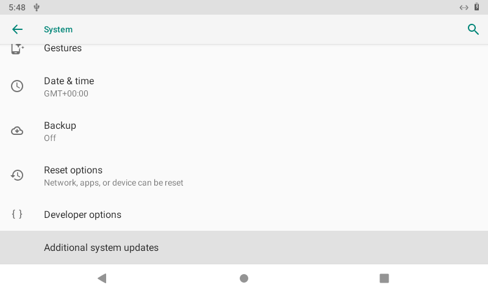
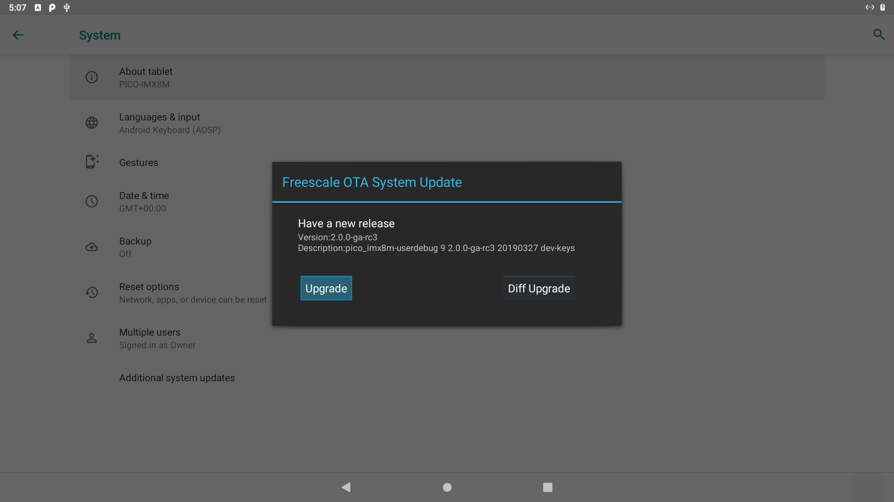
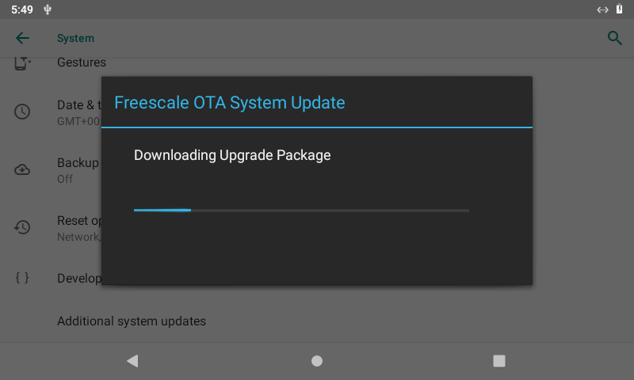
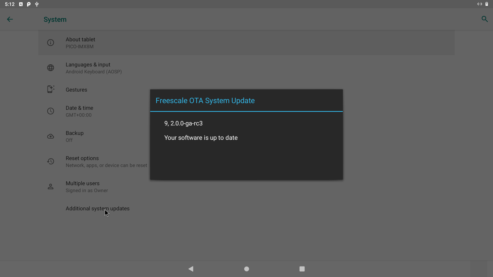

# Technexion Android 9 SDK for i.MX6/i.MX7 Platforms
## Download The Source code

Github way (Prepare repo command first is recommended)

    $ repo init -u https://github.com/technexion-android/manifest -b tn-p9.0.0_2.2.0-ga_tn1.0
    $ repo sync -j<N> (N is up to cors numbers on your host PC)

## Compiling Environment Setup
  
General Packages Installation ( Ubuntu 16.04 or above)

    $ sudo apt-get install uuid uuid-dev zlib1g-dev liblz-dev liblzo2-2 liblzo2-dev lzop \
    git-core curl u-boot-tools mtd-utils android-tools-fsutils device-tree-compiler gdisk \
    gnupg flex bison gperf build-essential zip curl zlib1g-dev gcc-multilib g++-multilib \
    libc6-dev-i386 lib32ncurses5-dev x11proto-core-dev libx11-dev lib32z-dev libgl1-mesa-dev \
    libxml2-utils xsltproc unzip sshpass ssh-askpass zip xz-utils kpartx vim screen sudo wget \
    bc locales openjdk-8-jdk rsync docker.io python3 kmod cgpt bsdmainutils lzip hdparm

Technexion Docker Image Production

    $ cd cookers
    $ docker build -t build_droid9 .
    $ sudo docker run --privileged=true --name mx9_build  -v /home/<user name>/<source folder>:/home/mnt -t -i build_droid9 bash
    (first time)

    $ sudo docker ps -a
    $ sudo docker start <your container id>
    $ sudo docker exec -it mx8_build bash
    (after first time)

## Starting Compile The Source Code

Source the compile relative commands:

    For PICO-IMX6Q with PI: VL050-8048NT-C01 5-inch LCD (800x480 resolution via LCD interface)

    $ source cookers/env.bash.imx6q.pico-imx6.pi.lcd-5-inch

    For PICO-IMX6DL with PI: VL050-8048NT-C01 5-inch LCD (800x480 resolution via LCD interface)

    $ source cookers/env.bash.imx6dl.pico-imx6.pi.lcd-5-inch

    For PICO-IMX6Q with NYMPH: HDMI (720p)

    $ source cookers/env.bash.imx6q.pico-imx6.nymph.hdmi

    For PICO-IMX6DL with NYMPH: HDMI (720p)

    $ source cookers/env.bash.imx6dl.pico-imx6.nymph.hdmi

    For PICO-IMX6Q with NYMPH: VL070-10260NL-C01 7-inch LCD (1024x600 resolution via LVDS interface)

    $ source cookers/env.bash.imx6q.pico-imx6.nymph.lvds-7-inch

    For PICO-IMX6DL with NYMPH: VL070-10260NL-C01 7-inch LCD (1024x600 resolution via LVDS interface)

    $ source cookers/env.bash.imx6dl.pico-imx6.nymph.lvds-7-inch

    For EDM-IMX6Q with FAIRY: HDMI (720p)

    $ source cookers/env.bash.imx6q.edm1-imx6.fairy.hdmi

    For EDM-IMX6DL with FAIRY: HDMI (720p)

    $ source cookers/env.bash.imx6dl.edm1-imx6.fairy.hdmi

    For EDM-IMX6Q with FAIRY: VL050-8048NT-C01 5-inch LCD (800x480 resolution via LCD interface)

    $ source cookers/env.bash.imx6q.edm1-imx6.fairy.lcd-5-inch

    For EDM-IMX6DL with FAIRY: VL050-8048NT-C01 5-inch LCD (800x480 resolution via LCD interface)

    $ source cookers/env.bash.imx6dl.edm1-imx6.fairy.lcd-5-inch

    For TC0700 HMI: 7-inch LCD (1024x600 resolution via LVDS interface)

    $ source cookers/env.bash.imx6dl.edm1-imx6.fairy.tc0700

    For TC1000 HMI: 10-inch LCD (1280x800 resolution via LVDS interface)

    $ source cookers/env.bash.imx6dl.edm1-imx6.fairy.tc1000

    For TEP-1010 HMI: 10.1-inch LCD (1280x800 resolution via LVDS interface)

    $ source cookers/env.bash.imx6dl.tep5-imx6.fairy.lvds-10-inch

    For TEP-1560 HMI: 15.6-inch LCD (1366x768 resolution via LVDS interface)

    $ source cookers/env.bash.imx6dl.tep5-imx6.fairy.lvds-15-inch

    For PICO-IMX7D with PI: VL050-8048NT-C01 5-inch LCD (800x480 resolution via LCD interface)

    $ source cookers/env.bash.imx7d.pico-imx7.pi.lcd-5-inch

    For PICO-IMX7D with PI + VOICEHAT: VL050-8048NT-C01 5-inch LCD (800x480 resolution via LCD interface)

    $ source cookers/env.bash.imx7d.pico-imx7.pi.lcd-5-inch-voicehat

    For PICO-IMX7D with NYMPH: VGA (1024x768 resolution via VGA interface)

    $ source cookers/env.bash.imx7d.pico-imx7.nymph.vga

    For PICO-IMX7D with NYMPH: VGA (1024x768 resolution via VGA interface)

    $ source cookers/env.bash.imx7d.pico-imx7.nymph.vga

    For TEP1-IMX7 HDMI : VL050-8048NT-C01 5-inch LCD (800x480 resolution via LCD interface)

    $ source cookers/env.bash.imx7d.tep1-imx7.tep1.lcd-5-inch

Get the NXP restricted extra packages (recommended):

    $ merge_restricted_extras
    (sometimes could be stocking on the waiting github response, please try again)

For a full clean build:

    $ cook -j<N> (N is up to cors numbers on your host PC)

For an incremental build:

    $ heat -j<N> (N is up to cors numbers on your host PC)

For clean the all build files:

    $ throw

To Configuration in Linux Kernel part:

    $ cd vendor/nxp-opensource/kernel_imx/
    $ recipe (or make menuconfig)

## Flashing The Output Images

Output relative image files of path:

    $ ls <source>/out/target/product/<target board>/ (pico-imx6q or others)

Quick way for flashing to board (legacy way, adapt mfgtool or ums command):

    $ flashcard /dev/sdx y (x is your device node, y is up to your eMMC size, 4GB: y=3, 8GB: y=7, 16GB: y=13, 32GB: y=28)

About mfgtool detial (recommended):

Before flash your images to the eMMC, please change the boot mode to serial download mode first, then mount eMMC as a storage on host PC using mfgtool, every boot mode configuration of Technexion boards as following document:

* [mfgtool user guide](https://github.com/technexion-android/Documents/blob/android-9_imx6_imx7/pdf/PreBuilt_OS_Image_Installation_Guide_v3.5.pdf)

About ums detial:

Another modular way is use ums command on your currect u-boot inside the eMMC, connect the USB OTG cable to host PC, then ums will auto mounting a storage on host PC, ums command as following:

    # ums 0 mmc 0 (mmc device number is up to your board, you can choose to 1 if 0 is not work)

Remember the ums is no need change the boot mode, but the disadvangage is the flash speed is slower than mfgtool way, so we recommend the mfgtool is better.

## Enabling WiFi/BT function

Prepare WiFi/BT firmware

This SDK is supporting Qualcomm(QCA) WLAN module - QCA9377 as default configuration, Because of the license restriction, please contact TechNexion FAE or Sales to get licensed firmware files, default is disabled.

    Contact Window: sales@technexion.com

After getting the firmware binary: .. Decompress the tarball and put all the firmware files into 

    <source folder>/device/fsl/imx8m/pico_imx8m/wifi-firmware/

Then take the QCA9377 folder as target path such as:

    <source folder>/device/fsl/imx8m/pico_imx8m/wifi-firmware/QCA9377

Issue the command cook/heat again as previous Chapter "Compiling Environment Setup", WiFi/BT function will be working! Enjoy!

11/26 Update: Add QCA9377-5 M.2 WiFi/BT supporting:

Please take the WiFi via mPCIE firmware files to

    <source folder>/device/fsl/imx7d/tep1_imx7/qca9377-5_wifi_firmware/ath10k/QCA9377/hw1.0/

Please take the Bluetooth via USB firmware files to

    <source folder>/device/fsl/imx7d/tep1_imx7/bluetooth/

Issue the command cook/heat again as previous Chapter "Compiling Environment Setup", WiFi/BT function will be working! Enjoy!

## OTA Upgrade

Step 1. Setup an OTA server:

You can setup OTA server using any simple REST base http server such as LineageOTA:

* [LineageOTA](https://github.com/julianxhokaxhiu/LineageOTA)

On Android side, please change your path of OTA Client app if neceassary

    path: <source folder>/vendor/nxp-opensource/fsl_imx_demo/FSLOta/src/com/fsl/android/ota/OTAServerConfig.java

    - ota_folder = new String(product + "_" + android_name + "_" + version + "/");
    to
    + ota_folder = "builds/full/"; (just example, you can change to your path of the ota server)

Correct the IP address, port and path from target OTA server to ota.conf

    path: <source folder>device/fsl/imx6dq/etc/ota.conf

Step 2. Generating an upgradabled OTA package

When you're done the modified part for latest system revision, editing "<source>/device/fsl/imx6dq/pico_imx6/build_id.mk" and modify the BUILD_ID to latest revision.

Note that the BUILD_ID must be newer than your current system revision and date.

compile source code and generate the new ota package

    cook -j4
    make otapackage -j4

    path: <source folder>/out/target/product/pico_imx6/pico_imx6-ota-eng.root.zip
    path: <source folder>/out/target/product/pico_imx6/system/build.prop

Step 3. Moving upgrade requirement files to OTA server:

    cp build.prop <your server ota folder>/build.prop

    cp pico_imx6-ota-eng.root.zip <your server ota folder>/pico_imx6-ota-<date>.zip

Step 4. Now, you can starting upgrade Android system using OTA function

Clicking the "Additional System Updates" on the setting page to check the latest update revision

It will be showed the upgrade information when your OTA server is ready and detect the newer version

Clicking the "Upgrade", starting download and install to your current system

Auto do "Verifying" after upgrade done, it will be rebooted automatically when vefifying done

Do system upgrade on recovery mode automatically, after that, reboot and upgrade finish.

## LIBGPIOD JNI APIs

TN2.0 provide a demo app about libgpiod JNI Test, specific source code as following:
* [source code](https://github.com/technexion-android/packages_apps_GpiodJniTest.git)

Users can implement own GUI using our INPUT/OUTPUT APIs

    Setting GPIO as output with specific value:
    public native String  setGpioInfo(int gpiobank,int gpioline, int value)

    Setting GPIO as input and get a value:
    public native String  getGpioInfo(int gpiobank,int gpioline);

## Latest Demo Image

Detail can refer relative documents as following link:
* Images Downloading: ftp://download.technexion.net/demo_software/
* [User Guide](https://github.com/technexion-android/Documents/blob/android-9_imx6_imx7/pdf/)
* [Release Note](https://github.com/technexion-android/Documents/blob/android-9_imx6_imx7/pdf/)
* [Image Instruction](https://raw.githubusercontent.com/technexion-android/Documents/android-9_imx6_imx7/txt/README.txt)
